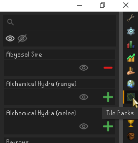
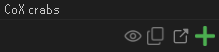
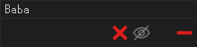
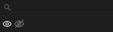
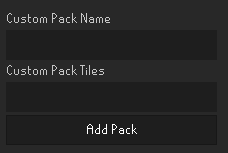

# Tile Packs

[Tile Packs Discord](https://discord.gg/4EQRWxY3Wb)

---

This plugin serves as a collection of tile packs you can add and remove quickly and easily, for content all over the game.

These tiles do not interfere with the ground markers plugin, they are saved separately.

If you have tiles you would like added, create an issue including the ground markers, or join the Discord.
You can export the ground markers from Runelite by right-clicking the minimap orb.
Use this tool to double-check your exported tiles. https://runelite.net/tile/

---
# Guide

### How do I use this plugin?
After installing and enabling the plugin, you will get a new icon in the right panel of runelite.
Selecting this will show the tile packs and all their options.

### Config options

- Toggle a pack on and off
  - The green add icon  will turn a pack on. The tiles will render the tiles in the world and minimap(if enabled).
  - The red remove icon  will turn a pack off. The tiles will not render in the world or minimap.
- The help icon  will open the source of the tiles of the pack in your browser. Most often a YouTube video.
- The copy icon  will copy the tiles of the pack to your clipboard.
- The visible icon  means the tile pack is not hidden. See [Searching and Filtering](#Searching and Filtering).
- The invisible icon  means the tile pack is hidden. See [Searching and Filtering](#Searching and Filtering).
- The delete icon  is to delete custom packs. This is permanent and they cannot be recovered. Default packs cannot be deleted, but they can be hidden.

### Searching and Filtering

- You can search for tile packs by their pack name. The search is not case sensitive, but is not a smart search and must be a partial substring of the title.
- The eye icon with no line is for showing packs that are NOT hidden in the list. When white, it is enabled and the visible packs will be shown. When grey, it is disabled and the visible packs will not be shown.
- The eye icon with a line through it is for showing packs that are hidden in the list. When white, it is enabled and the hidden packs will be shown. When grey, it is disabled and the hidden packs will not be shown.

### Adding a custom pack

You can add custom packs by scrolling all the way to the bottom of the tile pack list.
To add a custom pack, enter a pack name, and the tiles you want in the pack.

The tiles are formatted to be compatible with ground marker tiles.
You can import ground marker tiles by right clicking the minimap icon and choosing __Export ground markers__.
This will copy all loaded(in your render distance) ground markers to your clipboard.
If you get a formatting error, or want to edit the copied tiles, checkout the tool on https://runelite.net/tile/

---
## Credits

Icons made by [Freepik](https://www.flaticon.com/authors/pixel-perfect), [Utari Nuraeni](https://www.flaticon.com/authors/utari-nuraeni), [Andrean Prabowo](https://www.flaticon.com/authors/andrean-prabowo), and [uicon](https://www.flaticon.com/authors/uicon) from [flaticon.com](https://www.flaticon.com/).
